Egyetemisták elképzelései a jövő munkahelyéről
================
Granát Marcell

``` r
skimr::skim(survey)
```

|                                                  |        |
| :----------------------------------------------- | :----- |
| Name                                             | survey |
| Number of rows                                   | 417    |
| Number of columns                                | 103    |
| \_\_\_\_\_\_\_\_\_\_\_\_\_\_\_\_\_\_\_\_\_\_\_   |        |
| Column type frequency:                           |        |
| factor                                           | 101    |
| numeric                                          | 2      |
| \_\_\_\_\_\_\_\_\_\_\_\_\_\_\_\_\_\_\_\_\_\_\_\_ |        |
| Group variables                                  | None   |

Data summary

**Variable type: factor**

| skim\_variable | n\_missing | complete\_rate | ordered | n\_unique | top\_counts                          |
| :------------- | ---------: | -------------: | :------ | --------: | :----------------------------------- |
| v1             |          0 |           1.00 | FALSE   |         2 | Nő: 253, Fér: 164                    |
| v2             |          3 |           0.99 | FALSE   |        21 | Bud: 156, Pes: 66, Haj: 23, Sza: 19  |
| v3             |          2 |           1.00 | FALSE   |         5 | egy: 180, köz: 99, fői: 94, sza: 41  |
| v4             |          6 |           0.99 | FALSE   |        16 | Bud: 146, Bud: 58, Bud: 44, Deb: 31  |
| v5             |          0 |           1.00 | FALSE   |         5 | ala: 302, mes: 75, osz: 33, egy: 5   |
| v6             |          0 |           1.00 | FALSE   |        14 | gaz: 215, inf: 54, tár: 36, műs: 21  |
| v7             |          0 |           1.00 | FALSE   |         3 | ige: 211, nem: 136, ige: 70          |
| v8             |          1 |           1.00 | FALSE   |         4 | köz: 193, fel: 176, ala: 44, nin: 3  |
| v9             |          0 |           1.00 | FALSE   |         4 | nin: 176, ala: 126, köz: 84, fel: 31 |
| v10            |          0 |           1.00 | FALSE   |         2 | ige: 313, nem: 104                   |
| v11            |        101 |           0.76 | FALSE   |         2 | nem: 181, ige: 135                   |
| v12            |        107 |           0.74 | FALSE   |         3 | fél: 196, 3 h: 68, 3 h: 46           |
| v13            |        377 |           0.10 | FALSE   |         1 | KKV: 40                              |
| v14            |        394 |           0.06 | FALSE   |         1 | mag: 23                              |
| v15            |        353 |           0.15 | FALSE   |         1 | mul: 64                              |
| v16            |        406 |           0.03 | FALSE   |         1 | köz: 11                              |
| v17            |        398 |           0.05 | FALSE   |         1 | egy: 19                              |
| v18            |          2 |           1.00 | FALSE   |         4 | 5: 208, 4: 167, 3: 36, 2: 4          |
| v19            |          3 |           0.99 | FALSE   |         5 | 5: 242, 4: 135, 3: 26, 2: 8          |
| v20            |          3 |           0.99 | FALSE   |         5 | 5: 301, 4: 91, 3: 19, 2: 2           |
| v21            |          2 |           1.00 | FALSE   |         5 | 5: 224, 4: 150, 3: 34, 2: 6          |
| v22            |          2 |           1.00 | FALSE   |         5 | 4: 177, 5: 149, 3: 75, 2: 12         |
| v23            |          2 |           1.00 | FALSE   |         5 | 4: 143, 3: 134, 2: 61, 5: 56         |
| v24            |          2 |           1.00 | FALSE   |         5 | 3: 156, 4: 97, 2: 93, 1: 38          |
| v25            |          2 |           1.00 | FALSE   |         5 | 3: 141, 2: 103, 1: 83, 4: 64         |
| v26            |          2 |           1.00 | FALSE   |         5 | 4: 114, 3: 111, 5: 90, 2: 63         |
| v27            |          2 |           1.00 | FALSE   |         5 | 4: 136, 3: 116, 5: 113, 2: 35        |
| v28            |          2 |           1.00 | FALSE   |         5 | 5: 152, 4: 117, 3: 96, 2: 39         |
| v29            |          3 |           0.99 | FALSE   |         5 | 4: 141, 5: 138, 3: 91, 2: 29         |
| v30            |          4 |           0.99 | FALSE   |         5 | 4: 144, 5: 107, 3: 102, 2: 40        |
| v31            |          2 |           1.00 | FALSE   |         5 | 5: 158, 4: 142, 3: 83, 2: 22         |
| v32            |          2 |           1.00 | FALSE   |         5 | 5: 257, 4: 119, 3: 31, 2: 6          |
| v33            |          3 |           0.99 | FALSE   |         5 | 5: 161, 4: 149, 3: 78, 2: 21         |
| v34            |          2 |           1.00 | FALSE   |         5 | 5: 163, 4: 148, 3: 70, 2: 22         |
| v35            |          3 |           0.99 | FALSE   |         5 | 4: 151, 5: 135, 3: 103, 2: 18        |
| v36            |          4 |           0.99 | FALSE   |         5 | 4: 133, 5: 127, 3: 117, 2: 27        |
| v37            |          1 |           1.00 | FALSE   |         5 | 4: 161, 5: 133, 3: 92, 2: 24         |
| v38            |          1 |           1.00 | FALSE   |         5 | 4: 159, 3: 135, 5: 64, 2: 48         |
| v39            |          1 |           1.00 | FALSE   |         5 | 5: 165, 4: 143, 3: 76, 2: 28         |
| v40            |          1 |           1.00 | FALSE   |         5 | 4: 142, 5: 127, 3: 104, 2: 32        |
| v41            |          1 |           1.00 | FALSE   |         5 | 5: 267, 4: 90, 3: 40, 2: 14          |
| v42            |          2 |           1.00 | FALSE   |         5 | 4: 163, 5: 138, 3: 91, 2: 15         |
| v43            |          1 |           1.00 | FALSE   |         5 | 3: 121, 5: 118, 4: 112, 2: 51        |
| v44            |          1 |           1.00 | FALSE   |         5 | 4: 132, 5: 126, 3: 111, 2: 30        |
| v45            |          1 |           1.00 | FALSE   |         2 | Hoz: 385, Mun: 31                    |
| v46            |          1 |           1.00 | FALSE   |         2 | Mul: 331, Up : 85                    |
| v47            |         13 |           0.97 | FALSE   |         4 | 1: 236, 2: 86, 3: 52, 4: 30          |
| v48            |         13 |           0.97 | FALSE   |         4 | 2: 181, 3: 95, 1: 72, 4: 56          |
| v49            |         13 |           0.97 | FALSE   |         4 | 3: 158, 4: 101, 1: 77, 2: 68         |
| v50            |         13 |           0.97 | FALSE   |         4 | 4: 217, 3: 99, 2: 69, 1: 19          |
| v51            |          1 |           1.00 | FALSE   |         5 | 2-3: 179, 4-5: 155, 6-8: 42, 1 f: 23 |
| v52            |          1 |           1.00 | FALSE   |         6 | het: 197, het: 133, hav: 39, nap: 25 |
| v53            |          2 |           1.00 | FALSE   |         2 | ige: 238, nem: 177                   |
| v54            |        305 |           0.27 | FALSE   |         1 | pla: 112                             |
| v55            |        227 |           0.46 | FALSE   |         1 | táv: 190                             |
| v56            |        278 |           0.33 | FALSE   |         1 | rés: 139                             |
| v57            |        194 |           0.53 | FALSE   |         1 | saj: 223                             |
| v58            |        186 |           0.55 | FALSE   |         1 | nem: 231                             |
| v61            |          1 |           1.00 | FALSE   |         4 | 1,5: 219, 2 -: 137, 1 -: 38, nem: 22 |
| v62            |          3 |           0.99 | FALSE   |         4 | köz: 246, füg: 95, beo: 43, fel: 30  |
| v63            |          1 |           1.00 | FALSE   |         4 | 5: 230, 4: 143, 3: 36, 2: 7          |
| v64            |          1 |           1.00 | FALSE   |         3 | még: 180, ige: 132, nem: 104         |
| v65            |        289 |           0.31 | FALSE   |        14 | Ame: 21, Egy: 14, Aus: 13, egy: 12   |
| v66            |        286 |           0.31 | FALSE   |         2 | ige: 120, nem: 11                    |
| v67            |          4 |           0.99 | FALSE   |         4 | ann: 188, áll: 156, a m: 37, eze: 32 |
| v68            |        188 |           0.55 | FALSE   |         1 | Sze: 229                             |
| v69            |        177 |           0.58 | FALSE   |         1 | Mag: 240                             |
| v70            |        199 |           0.52 | FALSE   |         1 | Lak: 218                             |
| v71            |        160 |           0.62 | FALSE   |         1 | Csa: 257                             |
| v72            |        153 |           0.63 | FALSE   |         1 | Bar: 264                             |
| v73            |        154 |           0.63 | FALSE   |         1 | Sza: 263                             |
| v74            |          2 |           1.00 | FALSE   |         3 | áll: 318, önk: 91, rés: 6            |
| v75            |         93 |           0.78 | FALSE   |         2 | nem: 259, ige: 65                    |
| v76            |          2 |           1.00 | FALSE   |         2 | nem: 344, ige: 71                    |
| v77            |          1 |           1.00 | FALSE   |         4 | ige: 165, ige: 115, nem: 95, ige: 41 |
| v78            |          2 |           1.00 | FALSE   |         3 | biz: 315, tel: 59, fix: 41           |
| v79            |          2 |           1.00 | FALSE   |         4 | 3-8: 273, 1-2: 66, 8-1: 45, soh: 31  |
| v80            |          2 |           1.00 | FALSE   |         4 | kül: 177, a k: 120, egy: 64, táv: 54 |
| v81            |          2 |           1.00 | FALSE   |         2 | ige: 369, nem: 46                    |
| v82            |          3 |           0.99 | FALSE   |        11 | 8: 89, 10: 86, 7: 79, 6: 37          |
| v83            |          5 |           0.99 | FALSE   |        11 | 0: 58, 2: 56, 1: 54, 3: 51           |
| v84            |          5 |           0.99 | FALSE   |        11 | 7: 84, 8: 61, 6: 55, 5: 50           |
| v85            |          6 |           0.99 | FALSE   |        11 | 8: 80, 7: 73, 6: 52, 5: 46           |
| v86            |          5 |           0.99 | FALSE   |        11 | 7: 76, 6: 63, 8: 63, 5: 48           |
| v87            |          6 |           0.99 | FALSE   |        11 | 10: 169, 9: 90, 8: 53, 7: 23         |
| v88            |          6 |           0.99 | FALSE   |        11 | 0: 87, 3: 60, 2: 57, 1: 52           |
| v89            |          4 |           0.99 | FALSE   |        11 | 8: 124, 7: 75, 9: 60, 6: 45          |
| v90            |          4 |           0.99 | FALSE   |        11 | 8: 75, 6: 68, 7: 63, 9: 42           |
| v91            |          4 |           0.99 | FALSE   |        11 | 8: 83, 7: 71, 9: 69, 10: 59          |
| v92            |          3 |           0.99 | FALSE   |        11 | 9: 77, 8: 74, 10: 66, 7: 51          |
| v93            |          3 |           0.99 | FALSE   |        11 | 8: 63, 7: 60, 6: 49, 9: 46           |
| v94            |          3 |           0.99 | FALSE   |        11 | 8: 84, 7: 80, 9: 64, 6: 45           |
| v95            |          3 |           0.99 | FALSE   |        11 | 10: 107, 8: 92, 7: 62, 9: 48         |
| v96            |          4 |           0.99 | FALSE   |         5 | töb: 216, idő: 92, min: 67, rit: 36  |
| v97            |          4 |           0.99 | FALSE   |         5 | töb: 216, idő: 92, min: 67, rit: 36  |
| v98            |          4 |           0.99 | FALSE   |         5 | töb: 216, idő: 92, min: 67, rit: 36  |
| v99            |          3 |           0.99 | FALSE   |        11 | 7: 101, 6: 80, 5: 60, 8: 46          |
| v100           |          3 |           0.99 | FALSE   |        11 | 0: 101, 2: 65, 3: 49, 1: 48          |
| v101           |          3 |           0.99 | FALSE   |        11 | 5: 60, 6: 59, 4: 49, 3: 48           |
| v102           |          3 |           0.99 | FALSE   |        11 | 5: 62, 6: 51, 7: 51, 3: 46           |
| v103           |          3 |           0.99 | FALSE   |        11 | 5: 62, 7: 54, 8: 53, 4: 48           |

**Variable type: numeric**

| skim\_variable | n\_missing | complete\_rate |     mean |        sd |    p0 |    p25 |    p50 |    p75 |  p100 | hist  |
| :------------- | ---------: | -------------: | -------: | --------: | ----: | -----: | -----: | -----: | ----: | :---- |
| v59            |         45 |           0.89 | 326365.6 | 107238.56 | 80000 | 250000 | 300000 | 400000 | 6e+05 | ▁▇▇▃▃ |
| v60            |         19 |           0.95 | 231213.6 |  63918.26 | 80000 | 180000 | 230000 | 270000 | 4e+05 | ▂▇▇▃▂ |

``` r
ggplot(survey, aes(v1)) +
  geom_bar(color = "black", width = .6) +
  coord_flip() +
  labs(x = "", y = "", title = df_names[1, 2])
```

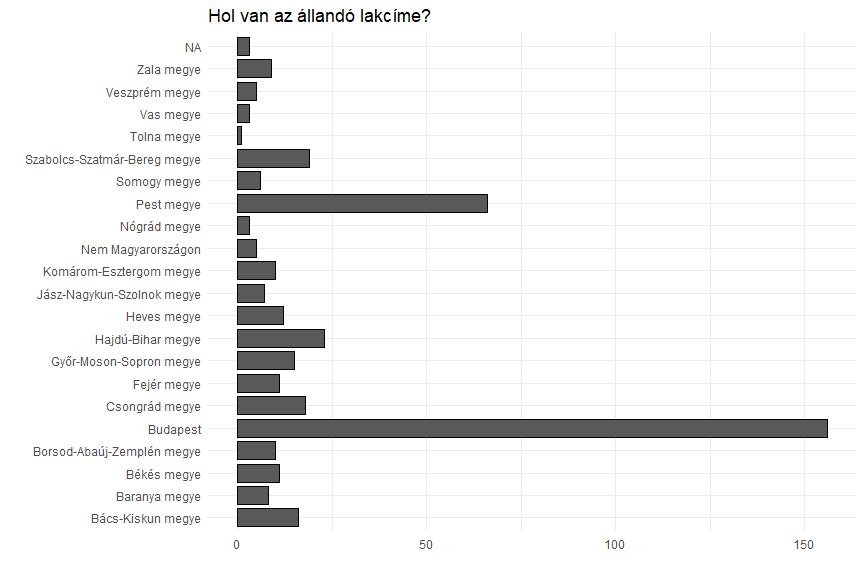

``` r
ggplot(survey, aes(v2)) +
  geom_bar(color = "black", width = .8) +
  coord_flip() +
  labs(x = "", y = "", title = df_names[2, 2])
```

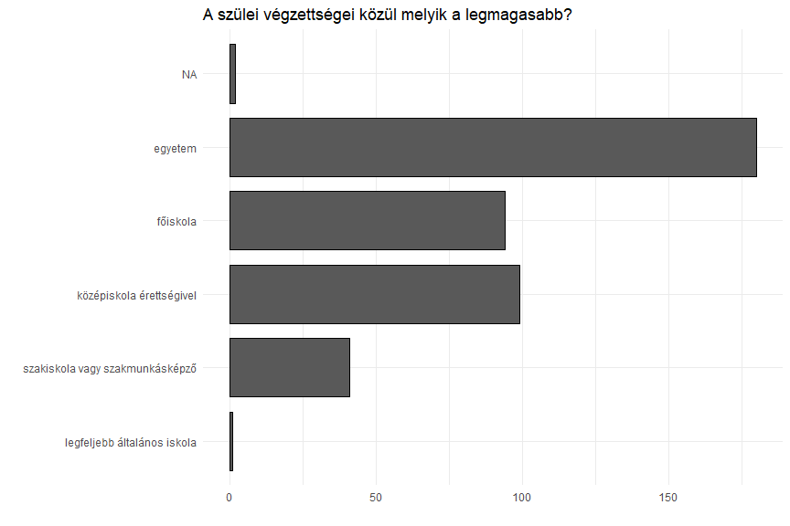

``` r
ggplot(survey, aes(v3)) +
  geom_bar(color = "black", width = .8) +
  coord_flip() +
  labs(x = "", y = "", title = df_names[3, 2])
```


``` r
ggplot(survey, aes(v4)) +
  geom_bar(color = "black", width = .8) +
  coord_flip() +
  labs(x = "", y = "", title = df_names[4, 2])
```

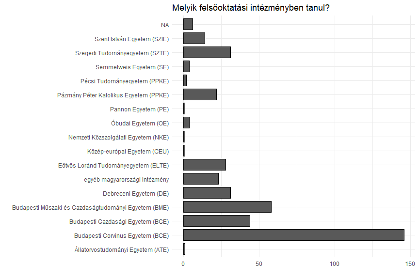

``` r
ggplot(survey, aes(v5)) +
  geom_bar(color = "black", width = .8) +
  coord_flip() +
  labs(x = "", y = "", title = "Milyen képzésre jár?")
```

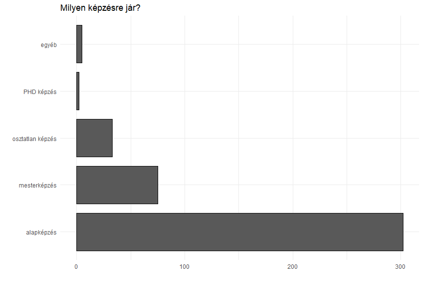

``` r
ggplot(survey, aes(v6)) +
  geom_bar(color = "black", width = .8) +
  coord_flip() +
  labs(x = "", y = "", title = "Milyen képzési területre jár?")
```

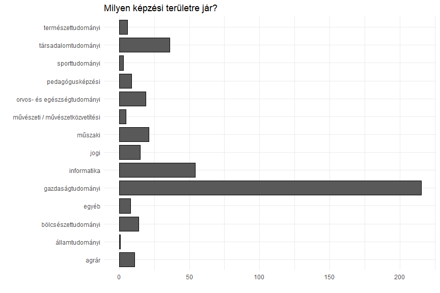

``` r
ggplot(survey, aes(v7)) +
  geom_bar(color = "black", width = .8) +
  coord_flip() +
  labs(x = "", y = "", title = df_names[7, 2])
```

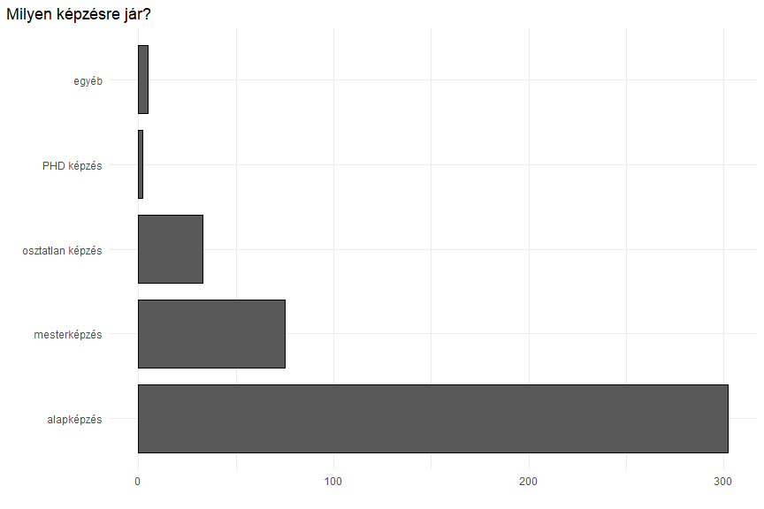

``` r
ggplot(survey, aes(v8)) +
  geom_bar(color = "black", width = .8) +
  coord_flip() +
  labs(x = "", y = "", title = df_names[8, 2])
```

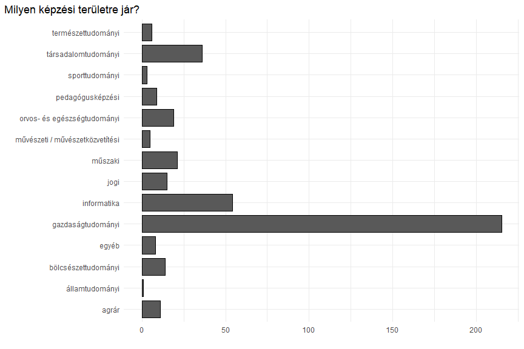

``` r
ggplot(survey, aes(v9)) +
  geom_bar(color = "black", width = .8) +
  coord_flip() +
  labs(x = "", y = "", title = df_names[9, 2])
```

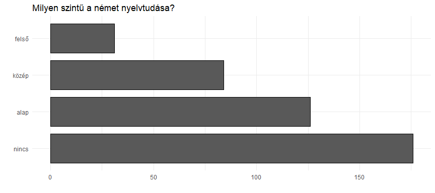

``` r
ggplot(survey, aes(v10)) +
  geom_bar(color = "black", width = .8) +
  coord_flip() +
  labs(x = "", y = "", title = df_names[10, 2])
```

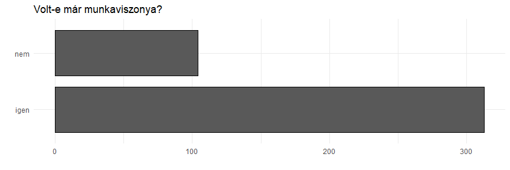

``` r
ggplot(survey, aes(v11)) +
  geom_bar(color = "black", width = .8) +
  coord_flip() +
  labs(x = "", y = "", title = df_names[11, 2])
```

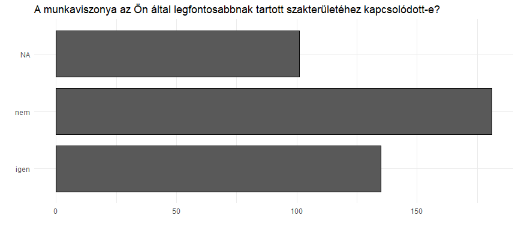

``` r
ggplot(survey, aes(v12)) +
  geom_bar(color = "black", width = .8) +
  coord_flip() +
  labs(x = "", y = "", title = df_names[12, 2])
```

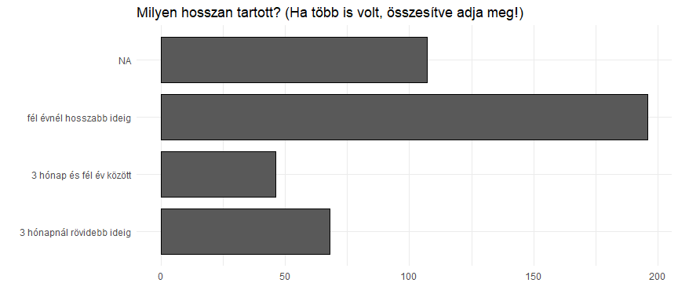

``` r
survey %>%
  select(v13:v17) %>%
  gather() %>%
  filter(!is.na(value)) %>%
  count(value) %>%
  mutate(
    n = n / sum(n),
    value = fct_reorder(value, n)
  ) %>%
  arrange(desc(n)) %>%
  mutate(c_n = cumsum(n) - n / 2) %>%
  ggplot(aes(x = "", y = n, fill = value)) +
  geom_bar(stat = "identity") +
  coord_polar("y", start = 0) +
  ggrepel::geom_label_repel(aes(x = "", y = c_n, label = scales::percent(n, accuracy = .01)), fill = "white", size = 5, show.legend = F, nudge_x = 1) +
  scale_fill_grey() +
  theme_void() +
  theme(
    legend.title = element_blank()
  )
```

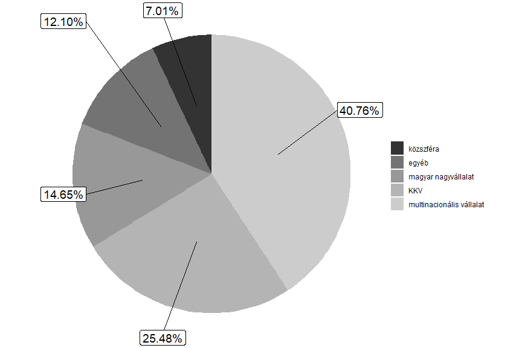

``` r
df <- survey %>%
  select(v18:v36) %>%
  gather() %>%
  group_by(key, value) %>%
  summarize(n = n() / nrow(survey)) %>%
  mutate(
    value = factor(value),
    n = ifelse(value == 3, n / 2, n)
  )

v <- sapply(str_split(df_names[18:36, 2], "> "), "[", 2)
v[12] <- "Azonosuljon a cég céljaival és értékrendjével"
v[14] <- "Kezdeményezések a testi és lelki jólététért"
v[15] <- "Munkaterhelés a munkaidő alatt kezelhető legyen"
v[16] <- "Munkakörnyezet megléte, amely elősegíti a jólétet"
v[17] <- "Munkahely támogassa a táv- és a virtuális munkát"
v[18] <- "Dönthessen arról, hogy hogyan strukturálja a munkáját"
v[19] <- "Virtuális platform, amely elősegíti az együttműködést"


ggplot() +
  geom_hline(yintercept = 0, color = "black", size = 1.1) +
  geom_bar(data = filter(df, as.numeric(value) < 4), aes(x = key, y = -n, fill = factor(value)), position = "stack", stat = "identity", color = "black") +
  geom_bar(data = filter(df, as.numeric(value) > 2), aes(x = key, y = n, fill = factor(value)), position = position_stack(reverse = TRUE), stat = "identity", color = "black") +
  scale_fill_grey() +
  coord_flip() +
  xlab("") +
  ylab("") +
  labs(
    title = "Munkahely kapcsán egyes tényezőknek tulajdonított prioritások",
    subtitle = "Mennyire tartja fontosnak az alábbi szempontokat egy munkahely kapcsán? (1-5)"
  ) +
  scale_y_continuous(labels = scales::percent_format(accuracy = 1), expand = c(0, 0), breaks = seq(-1, 1, 0.25), limits = c(-1, 1)) +
  scale_x_discrete(labels = v)
```

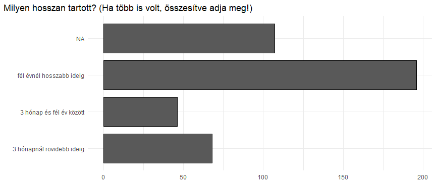

``` r
survey_W_outliers %>% select(v59, v60) %>% gather() %>% ggplot() +
  geom_boxplot(aes(x=key, y=value)) +
  scale_y_log10() + coord_flip() +
  scale_x_discrete(labels = c("amennyivel elégedett lenne?","amely az Ön szakterületén\npályakezdőként elérhető?")) +
  labs(x="", y="", title = "Mekkora az a havi jövedelem, ...", subtitle = "Dobozábra",
    caption = "Logaritmikus skála, az eltávolítandó kiugró értékeket pont jelöli.")
```

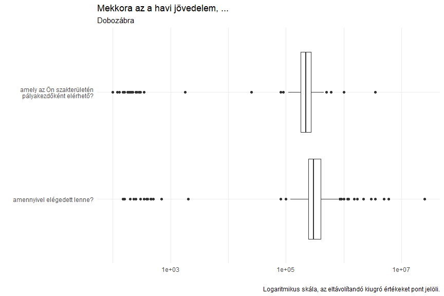

``` r
survey %>% select(v59,v60) %>% gather() %>% filter(!is.na(value)) %>% ggplot() +
  geom_histogram(aes(value), color = "black", fill = "grey80") + 
  facet_wrap(~key, nrow = 2, labeller =  labeller(key=c(v59="amennyivel elégedett lenne?", v60="amely az Ön szakterületén pályakezdőként elérhető?"))) + 
  labs(x="", y="", title = "Mekkora az a havi jövedelem, ...", subtitle = "Hisztogram",
    caption = "A vízszintes tengelyen az értékek forintban értendőek, '000") +
  geom_vline(data = data.frame(key = c("v59", "v60"), value = c(mean(survey$v59, na.rm = T), mean(survey$v60, na.rm = T))),
             aes(xintercept = value, color = "Átlag"), linetype = "dashed", size = 1.1) +
  scale_x_continuous(breaks = seq(from=100000, to=600000, by = 100000), labels = seq(from=100, to=600, by = 100)) +
  scale_color_manual(values = c("Átlag" = "red")) + theme(
    legend.position = "bottom"
  )
```

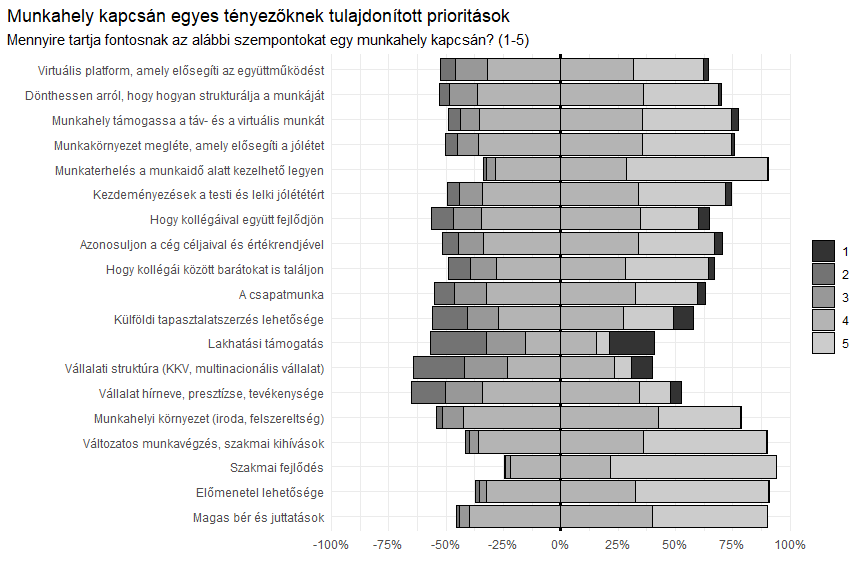

``` r
survey %>% ggplot(aes(x = v59, y = v60)) +
  geom_hline(aes(yintercept = mean(survey$v60, na.rm = T), color = "Átlag"), linetype = "dashed") +
  geom_vline(xintercept = mean(survey$v59, na.rm = T), color = "black", linetype = "dashed") +
  geom_point(alpha = .5) +
  geom_smooth(method = "lm", color = "red") +
  scale_x_continuous(breaks = seq(from = 100000, to = 600000, by = 100000), labels = seq(from = 100, to = 600, by = 100)) +
  scale_y_continuous(breaks = seq(from = 100000, to = 600000, by = 100000), labels = seq(from = 100, to = 600, by = 100)) +
  labs(
    x = "amennyivel elégedett lenne?", y = "amely az Ön szakterületén pályakezdőként elérhető?", title = "Mekkora az a havi jövedelem, ...",
    caption = "Az értékek forintban értendőek, '000",
    subtitle = str_c("r = ", survey %>% select(v59, v60) %>% na.exclude() %>% cor() %>% min() %>% round(digits = 2))
  ) +
  scale_color_manual(values = c("Átlag" = "black")) +
  theme(
    legend.position = "bottom"
  )
```

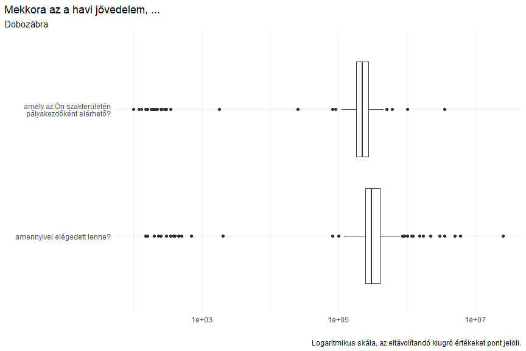

``` r
v <- df_names[-c(59,60),2]
cramer_matrix <- survey %>% select(-c(v59, v60)) %>% 
  mutate_all(funs(
    fct_explicit_na(., na_level = "nem válaszolt")
                  )
             ) %>% 
          data.frame() %>% cramer() %>% data.frame() %>% mutate(
               x = names(.)
             ) %>% gather(key = "y", value = "value", -x) %>% mutate(
                  x = as.numeric(str_remove(x, "v")),
                  y = as.numeric(str_remove(y, "v")),
                  y = ifelse(x > y, y, NA),
             )

cramer_matrix %>% ggplot() +
            geom_tile(aes(x = x, y = y, fill = value), color = "black", linejoin =  "mitre", size = .01 ) +
  scale_fill_gradient(low = "white", high = "#FF5B6B") +
  scale_x_discrete(expand = c(0, 0), limits = seq(from = 10, by = 10, to = 100)) +
  scale_y_discrete(expand = c(0, 0), limits = seq(from = 10, by = 10, to = 100)) +
  labs(
  x =  "1. változó sorszáma a kapcsolatvizsgálat során",
  y = "2. változó sorszáma a kapcsolatvizsgálat során",
  title = "Cramer-mutatók mátrixa"
)
```

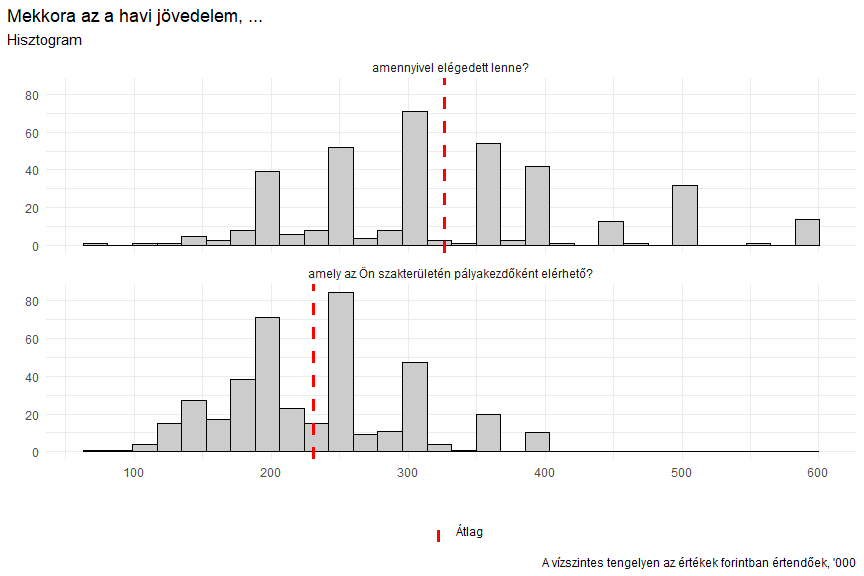

``` r
cramer_matrix %>% mutate(
  x = v[x],
  y = v[y],
  value = round(value, digits = 2)
) %>% filter(!is.na(y)) %>% 
  arrange(desc(value)) %>% head(20) %>% knitr::kable(caption = "Legnagyobb Cramer-mutatóval rendelkező párosítások")
```

| x                                                                                                        | y                                                                                                                                                                                | value |
| :------------------------------------------------------------------------------------------------------- | :------------------------------------------------------------------------------------------------------------------------------------------------------------------------------- | ----: |
| Értékelje 0-tól 10-ig a következőket\! \> Ön szerint mennyire lehet megbízni az emberekben általában?    | Mostanában milyen gyakran érezte magát magányosnak?                                                                                                                              |  1.00 |
| Értékelje 0-tól 10-ig a következőket\! \> Mennyire bízik meg Ön személy szerint a politikai rendszerben? | Mostanában milyen gyakran érezte magát magányosnak?                                                                                                                              |  1.00 |
| Értékelje 0-tól 10-ig a következőket\! \> Mennyire bízik meg Ön személy szerint a politikai rendszerben? | Értékelje 0-tól 10-ig a következőket\! \> Ön szerint mennyire lehet megbízni az emberekben általában?                                                                            |  1.00 |
| A munkaviszonya az Ön által legfontosabbnak tartott szakterületéhez kapcsolódott-e?                      | Volt-e már munkaviszonya?                                                                                                                                                        |  0.98 |
| Milyen hosszan tartott? (Ha több is volt, összesítve adja meg\!)                                         | Volt-e már munkaviszonya?                                                                                                                                                        |  0.98 |
| Melyiket tartja fontosabbnak? (Hozzáadott érték vagy munkaidő kitöltése)                                 | Melyik tényezők miatt mondana fel egy munkahelyen? (1: emiatt nem mondanék fel - 5: emiatt mindenképpen felmondanék) \> Ha az előrejutás nem szakmai szempontok alapján történik |  0.73 |
| Melyiket tartja fontosabbnak? (Hozzáadott érték vagy munkaidő kitöltése)                                 | Melyik tényezők miatt mondana fel egy munkahelyen? (1: emiatt nem mondanék fel - 5: emiatt mindenképpen felmondanék) \> Monoton munka, kevés kihívás                             |  0.72 |
| Melyiket tartja fontosabbnak? (Multiple career path vagy Up or out)                                      | Melyik tényezők miatt mondana fel egy munkahelyen? (1: emiatt nem mondanék fel - 5: emiatt mindenképpen felmondanék) \> Legalább 20%-kal magasabb bérajánlat máshonnan           |  0.72 |
| Mit tart ideálisnak a meetingek gyakoriságára vonatkozóan?                                               | Melyiket tartja fontosabbnak? (Hozzáadott érték vagy munkaidő kitöltése)                                                                                                         |  0.72 |
| Melyik országban?                                                                                        | Melyiket tartja fontosabbnak? (Hozzáadott érték vagy munkaidő kitöltése)                                                                                                         |  0.72 |
| Melyiket tartja fontosabbnak? (Hozzáadott érték vagy munkaidő kitöltése)                                 | Melyik tényezők miatt mondana fel egy munkahelyen? (1: emiatt nem mondanék fel - 5: emiatt mindenképpen felmondanék) \> A munkámat nem ismerik el                                |  0.71 |
| Melyiket tartja fontosabbnak? (Multiple career path vagy Up or out)                                      | Melyik tényezők miatt mondana fel egy munkahelyen? (1: emiatt nem mondanék fel - 5: emiatt mindenképpen felmondanék) \> A munkámat nem ismerik el                                |  0.71 |
| Melyiket tartja fontosabbnak? (Hozzáadott érték vagy munkaidő kitöltése)                                 | Melyik tényezők miatt mondana fel egy munkahelyen? (1: emiatt nem mondanék fel - 5: emiatt mindenképpen felmondanék) \> A béremelés kicsiny mértéke, elmaradása                  |  0.71 |
| Melyiket tartja fontosabbnak? (Multiple career path vagy Up or out)                                      | Melyik tényezők miatt mondana fel egy munkahelyen? (1: emiatt nem mondanék fel - 5: emiatt mindenképpen felmondanék) \> A béremelés kicsiny mértéke, elmaradása                  |  0.71 |
| Melyiket tartja fontosabbnak? (Multiple career path vagy Up or out)                                      | Melyik tényezők miatt mondana fel egy munkahelyen? (1: emiatt nem mondanék fel - 5: emiatt mindenképpen felmondanék) \> Ha az előrejutás nem szakmai szempontok alapján történik |  0.71 |
| Melyiket tartja fontosabbnak? (Hozzáadott érték vagy munkaidő kitöltése)                                 | Melyik tényezők miatt mondana fel egy munkahelyen? (1: emiatt nem mondanék fel - 5: emiatt mindenképpen felmondanék) \> Sok túlóra, nagy leterheltség                            |  0.71 |
| Melyiket tartja fontosabbnak? (Multiple career path vagy Up or out)                                      | Melyik tényezők miatt mondana fel egy munkahelyen? (1: emiatt nem mondanék fel - 5: emiatt mindenképpen felmondanék) \> Sok túlóra, nagy leterheltség                            |  0.71 |
| Melyiket tartja fontosabbnak? (Hozzáadott érték vagy munkaidő kitöltése)                                 | Melyik tényezők miatt mondana fel egy munkahelyen? (1: emiatt nem mondanék fel - 5: emiatt mindenképpen felmondanék) \> Túlórák ki nem fizetése                                  |  0.71 |
| Melyiket tartja fontosabbnak? (Multiple career path vagy Up or out)                                      | Melyik tényezők miatt mondana fel egy munkahelyen? (1: emiatt nem mondanék fel - 5: emiatt mindenképpen felmondanék) \> Túlórák ki nem fizetése                                  |  0.71 |
| Melyiket tartja fontosabbnak? (Multiple career path vagy Up or out)                                      | Melyik tényezők miatt mondana fel egy munkahelyen? (1: emiatt nem mondanék fel - 5: emiatt mindenképpen felmondanék) \> Monoton munka, kevés kihívás                             |  0.71 |

Legnagyobb Cramer-mutatóval rendelkező párosítások
