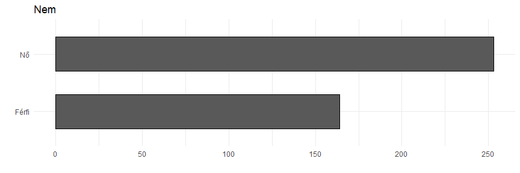

Egyetemisták elképzelései a jövő munkahelyéről
================
Granát Marcell

``` r
ggplot(survey, aes(v1)) + 
  geom_bar(color = "black", width = .6) + 
  coord_flip() + labs(x = "", y = "", title = df_names[1, 2])
```



``` r
ggplot(survey, aes(v2)) + 
  geom_bar(color = "black", width = .8) + 
  coord_flip() + labs(x = "", y = "",title = df_names[2, 2])
```


``` r
ggplot(survey, aes(v3)) + 
  geom_bar(color = "black", width = .8) + 
  coord_flip() + labs(x = "", y = "", title = df_names[3, 2])
```


``` r
ggplot(survey, aes(v4)) + 
  geom_bar(color = "black", width = .8) + 
  coord_flip() + labs(x = "", y = "", title = df_names[4, 2])
```


``` r
ggplot(survey, aes(v5)) + 
  geom_bar(color = "black", width = .8) + 
  coord_flip() + labs(x = "", y = "", title = "Milyen képzésre jár?")
```


``` r
ggplot(survey, aes(v6)) + 
  geom_bar(color = "black", width = .8) + 
  coord_flip() + labs(x = "", y = "", title = "Milyen képzési területre jár?")
```


``` r
ggplot(survey, aes(v7)) + 
  geom_bar(color = "black", width = .8) + 
  coord_flip() + labs(x = "", y = "", title = df_names[7, 2])
```


``` r
ggplot(survey, aes(v8)) + 
  geom_bar(color = "black", width = .8) + 
  coord_flip() + labs(x = "", y = "", title = df_names[8, 2])
```


``` r
ggplot(survey, aes(v9)) + 
  geom_bar(color = "black", width = .8) + 
  coord_flip() + labs(x = "", y = "", title = df_names[9, 2])
```


``` r
ggplot(survey, aes(v10)) + 
  geom_bar(color = "black", width = .8) + 
  coord_flip() + labs(x = "", y = "", title = df_names[10, 2])
```


``` r
ggplot(survey, aes(v11)) + 
  geom_bar(color = "black", width = .8) + 
  coord_flip() + labs(x = "", y = "", title = df_names[11, 2])
```


``` r
ggplot(survey, aes(v12)) + 
  geom_bar(color = "black", width = .8) + 
  coord_flip() + labs(x = "", y = "", title = df_names[12, 2])
```


``` r
survey %>% select(v13:v17) %>% gather() %>% filter(!is.na(value)) %>% count(value) %>%
  mutate(
    n = n/sum(n),
    value = fct_reorder(value, n)                                                               
  ) %>% arrange(desc(n)) %>% mutate(c_n = cumsum(n)-n/2) %>% 
  ggplot(aes(x="", y=n, fill=value)) + 
  geom_bar(stat = "identity") +
  coord_polar("y", start = 0) + 
  ggrepel::geom_label_repel(aes(x = "", y = c_n, label = scales::percent(n, accuracy = .01)), fill = "white", size = 5, show.legend = F, nudge_x = 1) +
  scale_fill_grey() +
  theme_void() + theme(
    legend.title = element_blank()
  )
```


``` r
df <- survey %>% select(v18:v36) %>% gather() %>% 
  group_by(key,value) %>% summarize(n=n()/nrow(survey)) %>% mutate(value = factor(value),
                                                                   n = ifelse(value == 3, n/2, n))

v <- sapply(str_split(df_names[18:36,2], "> "),"[",2)
v[12] <- "Azonosuljon a cég céljaival és értékrendjével"
v[14] <- "Kezdeményezések a testi és lelki jólététért"
v[15] <- "Munkaterhelés a munkaidő alatt kezelhető legyen"
v[16] <- "Munkakörnyezet megléte, amely elősegíti a jólétet"
v[17] <- "Munkahely támogassa a táv- és a virtuális munkát"
v[18] <- "Dönthessen arról, hogy hogyan strukturálja a munkáját"
v[19] <- "Virtuális platform, amely elősegíti az együttműködést"


ggplot() +
  geom_hline(yintercept = 0, color="black", size = 1.1) +
  geom_bar(data = filter(df, as.numeric(value)<4), aes(x = key, y = -n, fill = factor(value)) , position = "stack", stat = "identity", color = "black") +
  geom_bar(data = filter(df, as.numeric(value)>2), aes(x = key, y = n, fill = factor(value)) , position = position_stack(reverse = TRUE), stat = "identity", color = "black") +
  scale_fill_grey() + 
  coord_flip() +
  xlab("") +
  ylab("") +
  labs(
    title = "Munkahely kapcsán egyes tényezőknek tulajdonított prioritások",
    subtitle = "Mennyire tartja fontosnak az alábbi szempontokat egy munkahely kapcsán? (1-5)"
  ) +
  scale_y_continuous(labels = scales::percent_format(accuracy = 1), expand = c(0, 0), breaks = seq(-1, 1, 0.25), limits = c(-1, 1)) +
  scale_x_discrete(labels = v)
```


``` r
survey %>% ggplot(aes(x = v59, y = v60)) +
  geom_hline(aes(yintercept = mean(survey$v60, na.rm = T),color = "Átlag"), linetype = "dashed") +
  geom_vline(xintercept = mean(survey$v59, na.rm = T),color = "black", linetype = "dashed") +
  geom_point(alpha = .5) + 
  geom_smooth(method = "lm", color = "red") + 
  scale_x_continuous(breaks = seq(from = 100000, to = 600000, by = 100000), labels = seq(from = 100, to = 600, by = 100)) + 
  scale_y_continuous(breaks = seq(from = 100000, to = 600000, by = 100000), labels = seq(from = 100, to = 600, by = 100)) +
  labs(x = "amennyivel elégedett lenne?", y = "amely azÖn szakterületén pályakezdőként elérhető?", title = "Mekkora az a havi jövedelem, ...", 
       caption = "Az értékek forintban értendőek, '000",
       subtitle = str_c("r = ", survey %>% select(v59, v60) %>% na.exclude() %>% cor() %>% min() %>% round(digits = 2))
       ) +
  scale_color_manual(values = c("Átlag" = "black")) + theme(
    legend.position = "bottom"
  )
```


