Expectation of generations Y and X
================
Granát Marcell

## setup

``` r
library(tidyverse)
library(pedometrics)
load("EFOP_uni_student_survey.RData") # enviroment after Data cleaning.Rmd
attach(survey)
```

## Explorer the data

### Skim

``` r
survey %>%
  set_names(str_c(df_names$variable, ": ", df_names$english)) %>%
  skimr::skim()
```

|                                                  |            |
| :----------------------------------------------- | :--------- |
| Name                                             | Piped data |
| Number of rows                                   | 417        |
| Number of columns                                | 103        |
| \_\_\_\_\_\_\_\_\_\_\_\_\_\_\_\_\_\_\_\_\_\_\_   |            |
| Column type frequency:                           |            |
| factor                                           | 101        |
| numeric                                          | 2          |
| \_\_\_\_\_\_\_\_\_\_\_\_\_\_\_\_\_\_\_\_\_\_\_\_ |            |
| Group variables                                  | None       |

Data summary

**Variable type: factor**

| skim\_variable                                                                                                                                                                                                                                                                                   | n\_missing | complete\_rate | ordered | n\_unique | top\_counts                          |
| :----------------------------------------------------------------------------------------------------------------------------------------------------------------------------------------------------------------------------------------------------------------------------------------------- | ---------: | -------------: | :------ | --------: | :----------------------------------- |
| sex: Sex                                                                                                                                                                                                                                                                                         |          0 |           1.00 | FALSE   |         2 | Fem: 253, Mal: 164                   |
| adress: Where is your permanent address?                                                                                                                                                                                                                                                         |          3 |           0.99 | FALSE   |        21 | Bud: 156, Pes: 66, Haj: 23, Sza: 19  |
| parents\_edu: Which is the highest level of the education of your parents?                                                                                                                                                                                                                       |          2 |           1.00 | TRUE    |         5 | MSc: 180, hig: 99, BSc: 94, voc: 41  |
| uni: At which university do you study?                                                                                                                                                                                                                                                           |          6 |           0.99 | FALSE   |        16 | Cor: 146, Bud: 58, Bud: 44, Uni: 31  |
| level\_edu: What kind of education do you attend at this university? (If more than one, mark the one you consider the most important\!)                                                                                                                                                          |          0 |           1.00 | FALSE   |         5 | BSc: 302, MSc: 75, und: 33, oth: 5   |
| area\_edu: What is the area of your education? (If more than one, give the one you consider the most important\!)                                                                                                                                                                                |          0 |           1.00 | FALSE   |        14 | eco: 215, IT: 54, soc: 36, tec: 21   |
| continue\_edu: Do you plan to continue your education after your current studies?                                                                                                                                                                                                                |          0 |           1.00 | FALSE   |         3 | yes: 211, no: 136, yes: 70           |
| english\_knowledge: What is the level of your English knowledge?                                                                                                                                                                                                                                 |          1 |           1.00 | TRUE    |         4 | med: 193, upp: 176, bas: 44, non: 3  |
| german\_knowledge: What is the level of your German knowledge?                                                                                                                                                                                                                                   |          0 |           1.00 | TRUE    |         4 | non: 176, bas: 126, med: 84, upp: 31 |
| employed: Have you ever been employed?                                                                                                                                                                                                                                                           |          0 |           1.00 | FALSE   |         2 | yes: 313, no: 104                    |
| pro\_employed: Did this job connected to the field you consider the most appropriate for yourself?                                                                                                                                                                                               |        101 |           0.76 | FALSE   |         2 | no: 181, yes: 135                    |
| time\_employed: How much time did you spend in that position? (In case you’ve worked at several places, summarize them\!)                                                                                                                                                                        |        107 |           0.74 | TRUE    |         3 | mor: 196, les: 68, mor: 46           |
| company\_type\_SME: What kind of company have you worked for? \> SME                                                                                                                                                                                                                             |        377 |           0.10 | FALSE   |         1 | SME: 40                              |
| company\_type\_local: What kind of company have you worked for? \> local corporation                                                                                                                                                                                                             |        394 |           0.06 | FALSE   |         1 | loc: 23                              |
| company\_type\_multi: What kind of company have you worked for? \> multinational corporation                                                                                                                                                                                                     |        353 |           0.15 | FALSE   |         1 | mul: 64                              |
| company\_type\_public: What kind of company have you worked for? \> public sector                                                                                                                                                                                                                |        406 |           0.03 | FALSE   |         1 | pub: 11                              |
| company\_type\_other: What kind of company have you worked for? \> other                                                                                                                                                                                                                         |        398 |           0.05 | FALSE   |         1 | oth: 19                              |
| wpi\_wage: How important do you consider the following aspects for a workplace? (1: not important at all - 5: very important) \> High wages and benefits                                                                                                                                         |          2 |           1.00 | TRUE    |         4 | 5: 208, 4: 167, 3: 36, 2: 4          |
| wpi\_career: How important do you consider the following aspects for a workplace? (1: not important at all - 5: very important) \> Career advancement                                                                                                                                            |          3 |           0.99 | TRUE    |         5 | 5: 242, 4: 135, 3: 26, 2: 8          |
| wpi\_improvement: How important do you consider the following aspects for a workplace? (1: not important at all - 5: very important) \> Personal improvement                                                                                                                                     |          3 |           0.99 | TRUE    |         5 | 5: 301, 4: 91, 3: 19, 2: 2           |
| wpi\_challenge: How important do you consider the following aspects for a workplace? (1: not important at all - 5: very important) \> Interesting work, professional challenges                                                                                                                  |          2 |           1.00 | TRUE    |         5 | 5: 224, 4: 150, 3: 34, 2: 6          |
| wpi\_enviroment: How important do you consider the following aspects for a workplace? (1: not important at all - 5: very important) \> Work environment (office, equipment)                                                                                                                      |          2 |           1.00 | TRUE    |         5 | 4: 177, 5: 149, 3: 75, 2: 12         |
| wpi\_prestige: How important do you consider the following aspects for a workplace? (1: not important at all - 5: very important) \> Company reputation, prestige, activity                                                                                                                      |          2 |           1.00 | TRUE    |         5 | 4: 143, 3: 134, 2: 61, 5: 56         |
| wpi\_corporate: How important do you consider the following aspects for a workplace? (1: not important at all - 5: very important) \> Corporate structure (SME, MNE)                                                                                                                             |          2 |           1.00 | TRUE    |         5 | 3: 156, 4: 97, 2: 93, 1: 38          |
| wpi\_housing: How important do you consider the following aspects for a workplace? (1: not important at all - 5: very important) \> Housing allowance                                                                                                                                            |          2 |           1.00 | TRUE    |         5 | 3: 141, 2: 103, 1: 83, 4: 64         |
| wpi\_abroad: How important do you consider the following aspects for a workplace? (1: not important at all - 5: very important) \> Opportunity to gain experience abroad                                                                                                                         |          2 |           1.00 | TRUE    |         5 | 4: 114, 3: 111, 5: 90, 2: 63         |
| wpi\_team: How important do you consider the following aspects for a workplace? (1: not important at all - 5: very important) \> Team work                                                                                                                                                       |          2 |           1.00 | TRUE    |         5 | 4: 136, 3: 116, 5: 113, 2: 35        |
| wpi\_friends: How important do you consider the following aspects for a workplace? (1: not important at all - 5: very important) \> To find friends among your collegues                                                                                                                         |          2 |           1.00 | TRUE    |         5 | 5: 152, 4: 117, 3: 96, 2: 39         |
| wpi\_values: How important do you consider the following aspects for a workplace? (1: not important at all - 5: very important) \> To help you and your colleagues accept your company’s goals and values                                                                                        |          3 |           0.99 | TRUE    |         5 | 4: 141, 5: 138, 3: 91, 2: 29         |
| wpi\_develop: How important do you consider the following aspects for a workplace? (1: not important at all - 5: very important) \> To develop with your colleagues                                                                                                                              |          4 |           0.99 | TRUE    |         5 | 4: 144, 5: 107, 3: 102, 2: 40        |
| wpi\_well\_being: How important do you consider the following aspects for a workplace? (1: not important at all - 5: very important) \> To have opportunities that succesfully ensure the physical and mental well-being of employees                                                            |          2 |           1.00 | TRUE    |         5 | 5: 158, 4: 142, 3: 83, 2: 22         |
| wpi\_manageable\_wl: How important do you consider the following aspects for a workplace? (1: not important at all - 5: very important) \> Workload should be manageable during working hours, so that employees can take full advantage of their rest and relax in the evenings and on weekends |          2 |           1.00 | TRUE    |         5 | 5: 257, 4: 119, 3: 31, 2: 6          |
| wpi\_realxation: How important do you consider the following aspects for a workplace? (1: not important at all - 5: very important) \> A work environment ensuring well-being (for example, relaxation and recreation spaces) and adapting to different work styles                              |          3 |           0.99 | TRUE    |         5 | 5: 161, 4: 149, 3: 78, 2: 21         |
| wpi\_ho: How important do you consider the following aspects for a workplace? (1: not important at all - 5: very important) \> Workplace should support home office and virtual work                                                                                                             |          2 |           1.00 | TRUE    |         5 | 5: 163, 4: 148, 3: 70, 2: 22         |
| wpi\_free\_timeing: How important do you consider the following aspects for a workplace? (1: not important at all - 5: very important) \> Employee is free to decide how to structure his work                                                                                                   |          3 |           0.99 | TRUE    |         5 | 4: 151, 5: 135, 3: 103, 2: 18        |
| wpi\_platform: How important do you consider the following aspects for a workplace? (1: not important at all - 5: very important) \> Existence of a virtual platform to facilitate the cooperation with colleagues                                                                               |          4 |           0.99 | TRUE    |         5 | 4: 133, 5: 127, 3: 117, 2: 27        |
| quit\_respect: Which factors would cause you to quit at a workplace? (1: I would not quit because of this - 5: I would definitely quit because of this) \> My work is not respected                                                                                                              |          1 |           1.00 | TRUE    |         5 | 4: 161, 5: 133, 3: 92, 2: 24         |
| quit\_wageincrease: Which factors would cause you to quit at a workplace? (1: I would not quit because of this - 5: I would definitely quit because of this) \> The small rate or the lack of wage increase                                                                                      |          1 |           1.00 | TRUE    |         5 | 4: 159, 3: 135, 5: 64, 2: 48         |
| quit\_promotion: Which factors would cause you to quit at a workplace? (1: I would not quit because of this - 5: I would definitely quit because of this) \> Promotion is not based on professional considerations                                                                               |          1 |           1.00 | TRUE    |         5 | 5: 165, 4: 143, 3: 76, 2: 28         |
| quit\_workload: Which factors would cause you to quit at a workplace? (1: I would not quit because of this - 5: I would definitely quit because of this) \> Many overtime hours, heavy workload                                                                                                  |          1 |           1.00 | TRUE    |         5 | 4: 142, 5: 127, 3: 104, 2: 32        |
| quit\_overtime: Which factors would cause you to quit at a workplace? (1: I would not quit because of this - 5: I would definitely quit because of this) \> No payment of overtime                                                                                                               |          1 |           1.00 | TRUE    |         5 | 5: 267, 4: 90, 3: 40, 2: 14          |
| quit\_enviroment: Which factors would cause you to quit at a workplace? (1: I would not quit because of this - 5: I would definitely quit because of this) \> Professionally inappropriate environment                                                                                           |          2 |           1.00 | TRUE    |         5 | 4: 163, 5: 138, 3: 91, 2: 15         |
| quit\_monotnous: Which factors would cause you to quit at a workplace? (1: I would not quit because of this - 5: I would definitely quit because of this) \> Monotonous work, few challenges                                                                                                     |          1 |           1.00 | TRUE    |         5 | 3: 121, 5: 118, 4: 112, 2: 51        |
| quit\_salaryoffer: Which factors would cause you to quit at a workplace? (1: I would not quit because of this - 5: I would definitely quit because of this) \> At least 20% higher salary offer elsewhere                                                                                        |          1 |           1.00 | TRUE    |         5 | 4: 132, 5: 126, 3: 111, 2: 30        |
| value\_added: Which one do you consider more important? (Value added or Filling in working time)                                                                                                                                                                                                 |          1 |           1.00 | FALSE   |         2 | Val: 385, Fil: 31                    |
| up\_or\_out: Which one do you consider more important? (“Up or out” or “Multiple career path” )                                                                                                                                                                                                  |          1 |           1.00 | FALSE   |         2 | Mul: 331, Up : 85                    |
| prioritize\_wl\_balance: Prioritize the following\! Get ahead of what you think is the most important\! \> Work-life balance                                                                                                                                                                     |         13 |           0.97 | TRUE    |         4 | 1: 236, 2: 86, 3: 52, 4: 30          |
| prioritize\_salary: Prioritize the following\! Get ahead of what you think is the most important\! \> Salary                                                                                                                                                                                     |         13 |           0.97 | TRUE    |         4 | 2: 181, 3: 95, 1: 72, 4: 56          |
| prioritize\_pro\_progress: Prioritize the following\! Get ahead of what you think is the most important\! \> Professional progress                                                                                                                                                               |         13 |           0.97 | TRUE    |         4 | 3: 158, 4: 101, 1: 77, 2: 68         |
| prioritize\_realtions: Prioritize the following\! Get ahead of what you think is the most important\! \> Social relations                                                                                                                                                                        |         13 |           0.97 | TRUE    |         4 | 4: 217, 3: 99, 2: 69, 1: 19          |
| ppl\_room: What do you consider ideal, how many people should work in one room?                                                                                                                                                                                                                  |          1 |           1.00 | FALSE   |         5 | 2-3: 179, 4-5: 155, 6-8: 42, 1 p: 23 |
| meeting: What do you think about the ideal frequency for meetings?                                                                                                                                                                                                                               |          1 |           1.00 | TRUE    |         6 | Onc: 197, Mor: 133, Twi: 39, Dai: 25 |
| online\_contact: Would you require constant online contact with your colleagues?                                                                                                                                                                                                                 |          2 |           1.00 | FALSE   |         2 | yes: 238, no: 177                    |
| atypical\_platform: Which of the following atypical employment forms would you be interested in? \> platform based                                                                                                                                                                               |        305 |           0.27 | FALSE   |         1 | pla: 112                             |
| atypical\_telework: Which of the following atypical employment forms would you be interested in? \> telework                                                                                                                                                                                     |        227 |           0.46 | FALSE   |         1 | tel: 190                             |
| atypical\_part\_time: Which of the following atypical employment forms would you be interested in? \> part-time job                                                                                                                                                                              |        278 |           0.33 | FALSE   |         1 | par: 139                             |
| atypical\_startup: Which of the following atypical employment forms would you be interested in? \> startup                                                                                                                                                                                       |        194 |           0.53 | FALSE   |         1 | sta: 223                             |
| atypical\_non\_fixed: Which of the following atypical employment forms would you be interested in? \> non-fixed employment                                                                                                                                                                       |        186 |           0.55 | FALSE   |         1 | non: 231                             |
| fivey\_salary: After 5 years, how many times of your starting salary would you be satisfied?                                                                                                                                                                                                     |          1 |           1.00 | FALSE   |         4 | 1.5: 219, 2-2: 137, 1-1: 38, Thi: 22 |
| fivey\_position: After 5 years, what position do you want to achieve?                                                                                                                                                                                                                            |          3 |           0.99 | TRUE    |         4 | mid: 246, ind: 95, sub: 43, top: 30  |
| fiveyy\_development: How important is it to you to produce significant professional development (beyond material and hierarchical position) in 5 years?                                                                                                                                          |          1 |           1.00 | TRUE    |         4 | 5: 230, 4: 143, 3: 36, 2: 7          |
| work\_abroad: Do you plan to work abroad after graduation?                                                                                                                                                                                                                                       |          1 |           1.00 | FALSE   |         3 | I d: 180, yes: 132, no: 104          |
| work\_abroad\_c: In which country?                                                                                                                                                                                                                                                               |        289 |           0.31 | FALSE   |        14 | Uni: 21, Uni: 14, Aus: 13, oth: 12   |
| work\_abroad\_p: Do you plan on working abroad in your professional field?                                                                                                                                                                                                                       |        286 |           0.31 | FALSE   |         2 | yes: 120, no: 11                     |
| country\_stay: If you stayed in Hungary, where?                                                                                                                                                                                                                                                  |          4 |           0.99 | FALSE   |         4 | In : 188, In : 156, The: 37, In : 32 |
| stay\_enviroment: Which factors do you consider relevant to the answer to the previous question? \> intellectual and cultural environment                                                                                                                                                        |        188 |           0.55 | FALSE   |         1 | int: 229                             |
| stay\_material: Which factors do you consider relevant to the answer to the previous question? \> higher material appreciation                                                                                                                                                                   |        177 |           0.58 | FALSE   |         1 | hig: 240                             |
| stay\_housing: Which factors do you consider relevant to the answer to the previous question? \> housing and living expenses                                                                                                                                                                     |        199 |           0.52 | FALSE   |         1 | hou: 218                             |
| stay\_family: Which factors do you consider relevant to the answer to the previous question? \> family relationships                                                                                                                                                                             |        160 |           0.62 | FALSE   |         1 | fam: 257                             |
| stay\_friends: Which factors do you consider relevant to the answer to the previous question? \> friends relationships                                                                                                                                                                           |        153 |           0.63 | FALSE   |         1 | fri: 264                             |
| stay\_development: Which factors do you consider relevant to the answer to the previous question? \> professional challanges and opportunitiy for development                                                                                                                                    |        154 |           0.63 | FALSE   |         1 | pro: 263                             |
| scholarship: State scholarship, part-scholarship or self-financing student? (If more than one type of training is involved, indicate the stronger scholarship category\!)                                                                                                                        |          2 |           1.00 | FALSE   |         3 | ful: 318, sel: 91, par: 6            |
| mobility\_restrictions: Do mobility restrictions affect your future plans concerning working abroad?                                                                                                                                                                                             |         93 |           0.78 | FALSE   |         2 | no: 259, yes: 65                     |
| sabbatical\_know: Do you know what the term sabbatical means?                                                                                                                                                                                                                                    |          2 |           1.00 | FALSE   |         2 | no: 344, yes: 71                     |
| ho: Would you prefer home office?                                                                                                                                                                                                                                                                |          1 |           1.00 | TRUE    |         4 | yes: 165, yes: 115, no: 95, yes: 41  |
| work\_kind: What kind of work is best for you?                                                                                                                                                                                                                                                   |          2 |           1.00 | TRUE    |         3 | fle: 315, com: 59, fix: 41           |
| change\_job: How often would you change jobs?                                                                                                                                                                                                                                                    |          2 |           1.00 | FALSE   |         4 | eve: 273, eve: 66, eve: 45, nev: 31  |
| flexibility: How flexible are you about your place of work? Where would you work?                                                                                                                                                                                                                |          2 |           1.00 | TRUE    |         4 | I w: 177, Sur: 120, Not: 64, Fur: 54 |
| baby: Would it be helpful if the workplace was flexible (eg providing temporary part-time work) when you were having a baby?                                                                                                                                                                     |          2 |           1.00 | FALSE   |         2 | yes: 369, no: 46                     |
| goal\_confidence: How confident are you in achieving your career goals for the next 10 years?                                                                                                                                                                                                    |          3 |           0.99 | TRUE    |        11 | 8: 89, 10: 86, 7: 79, 6: 37          |
| ws\_high\_payment: Rate the following workplace situations from 0 to 10 \> High payment, 10-12 hours of work a day, sometimes even at weekends, international environment, stressful work                                                                                                        |          5 |           0.99 | TRUE    |        11 | 0: 58, 2: 56, 1: 54, 3: 51           |
| ws\_stable: Rate the following workplace situations from 0 to 10 \> Stable job, 8 hours of work a day, average payment                                                                                                                                                                           |          5 |           0.99 | TRUE    |        11 | 7: 84, 8: 61, 6: 55, 5: 50           |
| ws\_flexible: Rate the following workplace situations from 0 to 10 \> Flexible working hours, professional independence, non-hierarchical work organization, horizontal career path, payment based on the working hours, no fixed income                                                         |          6 |           0.99 | TRUE    |        11 | 8: 80, 7: 73, 6: 52, 5: 46           |
| ws\_inspiring: Rate the following workplace situations from 0 to 10 \> Inspiring professional environment, permanent urge of professional advancement, varied, challenging work, average payment                                                                                                 |          5 |           0.99 | TRUE    |        11 | 7: 76, 6: 63, 8: 63, 5: 48           |
| ws\_management: Rate the following workplace situations from 0 to 10 \> Top management position, high payment, effective decision-making team, stable job                                                                                                                                        |          6 |           0.99 | TRUE    |        11 | 10: 169, 9: 90, 8: 53, 7: 23         |
| ws\_large\_company: Rate the following workplace situations from 0 to 10 \> Large company, low chance of professional advancement, hierarchical work organization, average payment, unpaid overtime                                                                                              |          6 |           0.99 | TRUE    |        11 | 0: 87, 3: 60, 2: 57, 1: 52           |
| wb\_life: Rate the following from 0 to 10\! \> How satisfied are you with your life lately?                                                                                                                                                                                                      |          4 |           0.99 | TRUE    |        11 | 8: 124, 7: 75, 9: 60, 6: 45          |
| wb\_finance: Rate the following from 0 to 10\! \> How satisfied are you with your financial situation?                                                                                                                                                                                           |          4 |           0.99 | TRUE    |        11 | 8: 75, 6: 68, 7: 63, 9: 42           |
| wb\_study: Rate the following from 0 to 10\! \> How satisfied are you with your current study/work?                                                                                                                                                                                              |          4 |           0.99 | TRUE    |        11 | 8: 83, 7: 71, 9: 69, 10: 59          |
| wb\_conditions: Rate the following from 0 to 10\! \> How satisfied are you with the conditions of going to work/school?                                                                                                                                                                          |          3 |           0.99 | TRUE    |        11 | 9: 77, 8: 74, 10: 66, 7: 51          |
| wb\_time\_spent: Rate the following from 0 to 10\! \> How satisfied are you with the amount of time spent on things you like?                                                                                                                                                                    |          3 |           0.99 | TRUE    |        11 | 8: 63, 7: 60, 6: 49, 9: 46           |
| wb\_meaningful: Rate the following from 0 to 10\! \> Overall, how meaningful do you feel to the things you are doing?                                                                                                                                                                            |          3 |           0.99 | TRUE    |        11 | 8: 84, 7: 80, 9: 64, 6: 45           |
| wb\_hopefull: Rate the following from 0 to 10\! \> How hopelessly or hopefully do you look to the future? (0: completely hopelessly, 10: completely hopefully)                                                                                                                                   |          3 |           0.99 | TRUE    |        11 | 10: 107, 8: 92, 7: 62, 9: 48         |
| feel\_happy: Nowadays, how often did you feel \> happy?                                                                                                                                                                                                                                          |          4 |           0.99 | TRUE    |         5 | töb: 216, idő: 92, min: 67, rit: 36  |
| feel\_stress: Nowadays, how often did you feel \> stressful?                                                                                                                                                                                                                                     |          4 |           0.99 | TRUE    |         5 | töb: 216, idő: 92, min: 67, rit: 36  |
| feel\_lonely: Nowadays, how often did you feel \> lonely?                                                                                                                                                                                                                                        |          4 |           0.99 | TRUE    |         5 | töb: 216, idő: 92, min: 67, rit: 36  |
| trust\_ppl: Rate the following from 0 to 10\! \> What do you think how much do you can trust people in general?                                                                                                                                                                                  |          3 |           0.99 | TRUE    |        11 | 7: 101, 6: 80, 5: 60, 8: 46          |
| trust\_politicals: Rate the following from 0 to 10\! \> How much do you personally trust the political system?                                                                                                                                                                                   |          3 |           0.99 | TRUE    |        11 | 0: 101, 2: 65, 3: 49, 1: 48          |
| trust\_legals: Rate the following from 0 to 10\! \> How much do you personally trust legal system?                                                                                                                                                                                               |          3 |           0.99 | TRUE    |        11 | 5: 60, 6: 59, 4: 49, 3: 48           |
| trust\_police: Rate the following from 0 to 10\! \> How much do you personally trust the police?                                                                                                                                                                                                 |          3 |           0.99 | TRUE    |        11 | 5: 62, 6: 51, 7: 51, 3: 46           |
| trust\_military: Rate the following from 0 to 10\! \> How much do you personally trust the military?                                                                                                                                                                                             |          3 |           0.99 | TRUE    |        11 | 5: 62, 7: 54, 8: 53, 4: 48           |

**Variable type: numeric**

| skim\_variable                                                                                                                                      | n\_missing | complete\_rate |     mean |        sd |    p0 |    p25 |    p50 |    p75 |  p100 | hist  |
| :-------------------------------------------------------------------------------------------------------------------------------------------------- | ---------: | -------------: | -------: | --------: | ----: | -----: | -----: | -----: | ----: | :---- |
| comf\_salary: What is your monthly net salary that you would be comfortable with? (In Hungarian Forint)                                             |         45 |           0.89 | 326365.6 | 107238.56 | 80000 | 250000 | 300000 | 400000 | 6e+05 | ▁▇▇▃▃ |
| real\_salary: What do you think is the net monthly salary that is realistically available in your field as a career beginner? (In Hungarian Forint) |         19 |           0.95 | 231213.6 |  63918.26 | 80000 | 180000 | 230000 | 270000 | 4e+05 | ▂▇▇▃▂ |

### Plots

``` r
ggplot(mapping = aes(sex)) +
  geom_bar(color = "black", width = .6) +
  coord_flip() +
  labs(x = "", y = "", title = df_names[1, 3]) +
  scale_y_continuous(expand = expand_scale(mult = c(0, 0.05), add = c(0, 0)))
```

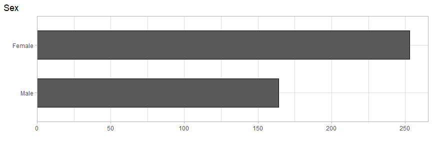

``` r
ggplot(mapping = aes(adress)) +
  geom_bar(color = "black", width = .8) +
  coord_flip() +
  labs(x = "", y = "", title = df_names[2, 3]) +
  scale_y_continuous(expand = expand_scale(mult = c(0, 0.05), add = c(0, 0)))
```

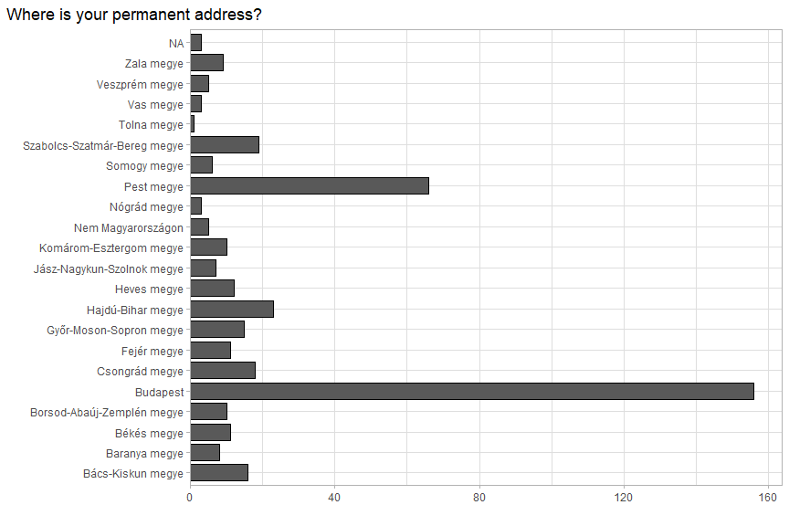

``` r
ggplot(mapping = aes(parents_edu)) +
  geom_bar(color = "black", width = .8) +
  coord_flip() +
  labs(x = "", y = "", title = df_names[3, 3])
```

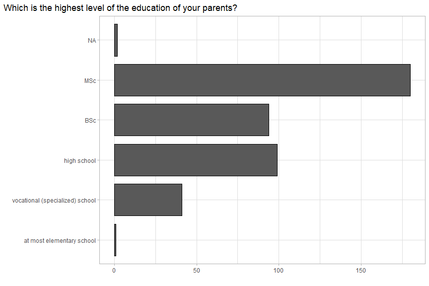

``` r
ggplot(mapping = aes(uni)) +
  geom_bar(color = "black", width = .8) +
  coord_flip() +
  labs(x = "", y = "", title = df_names[4, 3]) +
  scale_y_continuous(expand = expand_scale(mult = c(0, 0.05), add = c(0, 0)))
```

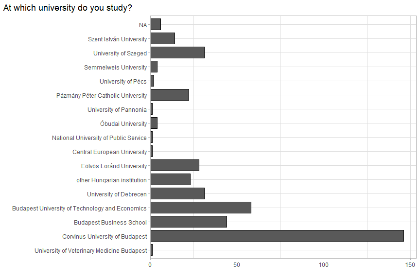

``` r
ggplot(mapping = aes(level_edu)) +
  geom_bar(color = "black", width = .8) +
  coord_flip() +
  labs(x = "", y = "", title = df_names[5, 3]) +
  scale_y_continuous(expand = expand_scale(mult = c(0, 0.05), add = c(0, 0)))
```

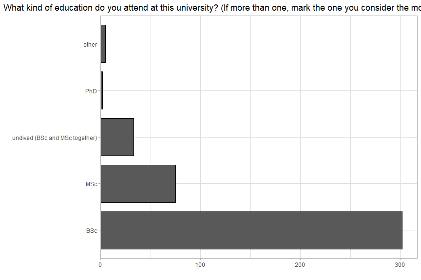

``` r
ggplot(mapping = aes(area_edu)) +
  geom_bar(color = "black", width = .8) +
  coord_flip() +
  labs(x = "", y = "", title = df_names[6, 3]) +
  scale_y_continuous(expand = expand_scale(mult = c(0, 0.05), add = c(0, 0)))
```

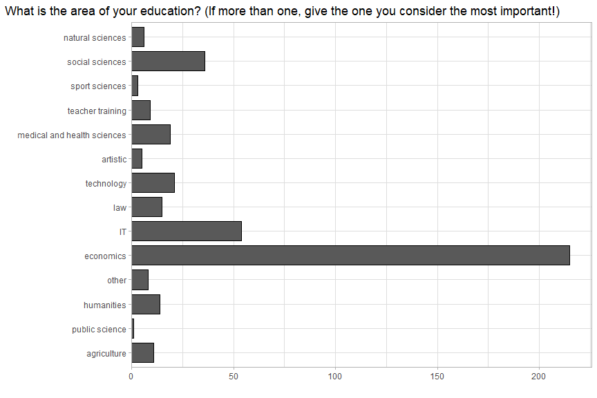

``` r
ggplot(mapping = aes(continue_edu)) +
  geom_bar(color = "black", width = .8) +
  coord_flip() +
  labs(x = "", y = "", title = df_names[7, 3]) +
  scale_y_continuous(expand = expand_scale(mult = c(0, 0.05), add = c(0, 0)))
```

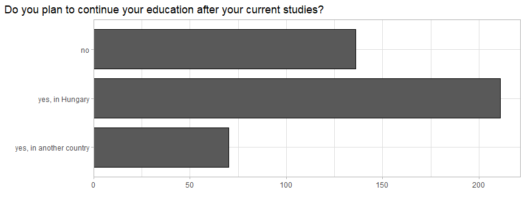

``` r
ggplot(mapping = aes(english_knowledge)) +
  geom_bar(color = "black", width = .8) +
  coord_flip() +
  labs(x = "", y = "", title = df_names[8, 3]) +
  scale_y_continuous(expand = expand_scale(mult = c(0, 0.05), add = c(0, 0)))
```

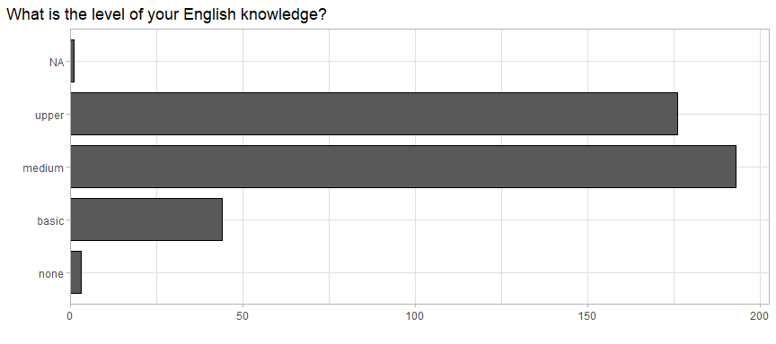

``` r
ggplot(mapping = aes(german_knowledge)) +
  geom_bar(color = "black", width = .8) +
  coord_flip() +
  labs(x = "", y = "", title = df_names[9, 3]) +
  scale_y_continuous(expand = expand_scale(mult = c(0, 0.05), add = c(0, 0)))
```

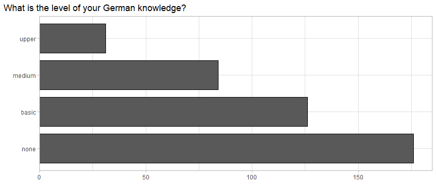

``` r
survey %>%
  select(employed:time_employed) %>%
  gather() %>%
  merge(df_names, by.x = "key", by.y = "variable") %>%
  filter(!is.na(value)) %>%
  ggplot(mapping = aes(value)) +
  geom_bar(color = "black", width = .8) +
  coord_flip() +
  labs(x = "", y = "", title = "Questions about employment") +
  facet_wrap(vars(english), scales = "free", ncol = 1)
```

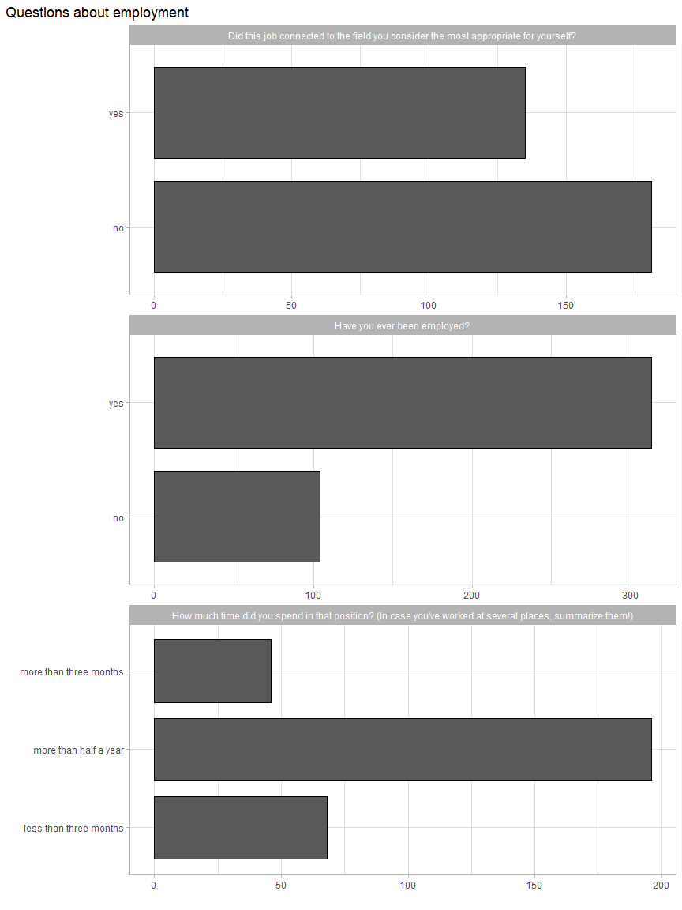

``` r
survey %>%
  select(company_type_SME:company_type_other) %>%
  gather(na.rm = T) %>%
  group_by(value) %>%
  tally() %>%
  transmute(
    n = n / sum(n),
    value = fct_reorder(value, n)
  ) %>%
  arrange(desc(n)) %>%
  mutate(c_n = cumsum(n) - n / 2) %>%
  ggplot(aes(x = "", y = n, fill = value)) +
  geom_bar(stat = "identity", color = "black") +
  coord_polar("y", start = 0) +
  ggrepel::geom_label_repel(aes(x = "", y = c_n, label = scales::percent(n, accuracy = .01)), fill = "white", size = 5, show.legend = F, nudge_x = 1) +
  scale_fill_grey() +
  theme_void() +
  ggtitle("What kind of company have you worked for?") +
  theme(
    legend.title = element_blank()
  )
```

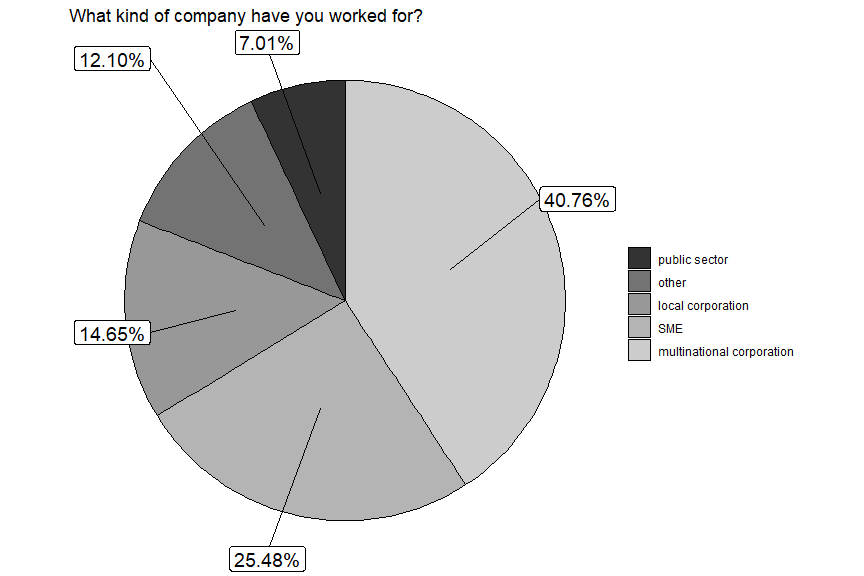

``` r
df <- survey %>%
  select(18:36) %>%
  gather(na.rm = T) %>%
  group_by(key, value) %>%
  summarize(n = n() / nrow(survey)) %>%
  mutate(
    value = factor(value),
    n = ifelse(value == 3, n / 2, n)
  )

ggplot() +
  geom_hline(yintercept = 0, color = "black", size = 1.1) +
  geom_bar(data = filter(df, as.numeric(value) < 4), aes(x = key, y = -n, fill = factor(value)), position = "stack", stat = "identity", color = "black") +
  geom_bar(data = filter(df, as.numeric(value) > 2), aes(x = key, y = n, fill = factor(value)), position = position_stack(reverse = TRUE), stat = "identity", color = "black") +
  scale_fill_grey() +
  coord_flip() +
  xlab("") +
  ylab("") +
  labs(
    title = "How important do you consider the following aspects for a workplace?",
    subtitle = "1: not important at all - 5: very important"
  ) +
  scale_y_continuous(labels = scales::percent_format(accuracy = 1), expand = c(0, 0), breaks = seq(-1, 1, 0.25), limits = c(-1, 1)) +
  scale_x_discrete(labels = df_names[[3]][18:36] %>% str_remove(".*> ") %>% str_wrap(width = 40)) +
  theme(
    legend.title = element_blank()
  )
```

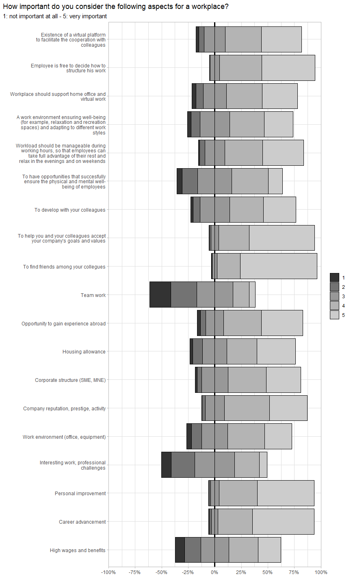

### Income Qs

``` r
survey_W_outliers %>%
  select(comf_salary, real_salary) %>%
  gather() %>%
  ggplot() +
  geom_boxplot(aes(x = key, y = value)) +
  scale_y_log10() +
  coord_flip() +
  scale_x_discrete(labels = c("you would be comfortable with?", "is realistically available\nin your field as a career beginner?")) +
  labs(
    x = "", y = "", title = "What is your monthly net salary that ...", subtitle = "Boxplot",
    caption = "Logaritmic scale, points show the detected outliers.\nValues are in Hungarian Forint."
  )
```

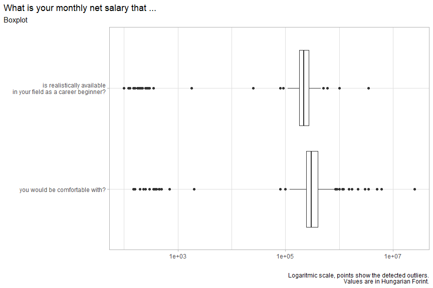

``` r
survey %>%
  select(comf_salary, real_salary) %>%
  gather() %>%
  filter(!is.na(value)) %>%
  ggplot() +
  geom_histogram(aes(value), color = "black", fill = "grey80") +
  facet_wrap(~key, nrow = 2, labeller = labeller(key = c(comf_salary = "you would be comfortable with?", real_salary = "is realistically available in your field as a career beginner?"))) +
  labs(
    x = "", y = "", title = "What is your monthly net salary that, ...", subtitle = "Histogram",
    caption = "Values on horizontal axis are in Forint, '000"
  ) +
  geom_vline(
    data = data.frame(key = c("comf_salary", "real_salary"), value = c(mean(survey$comf_salary, na.rm = T), mean(survey$real_salary, na.rm = T))),
    aes(xintercept = value, color = "Átlag"), linetype = "dashed", size = 1.1
  ) +
  scale_x_continuous(breaks = seq(from = 100000, to = 600000, by = 100000), labels = seq(from = 100, to = 600, by = 100), expand = c(0, 0), limits = c(100000, 600000)) +
  scale_color_manual(values = c("Átlag" = "red")) +
  theme(
    legend.position = "bottom"
  )
```

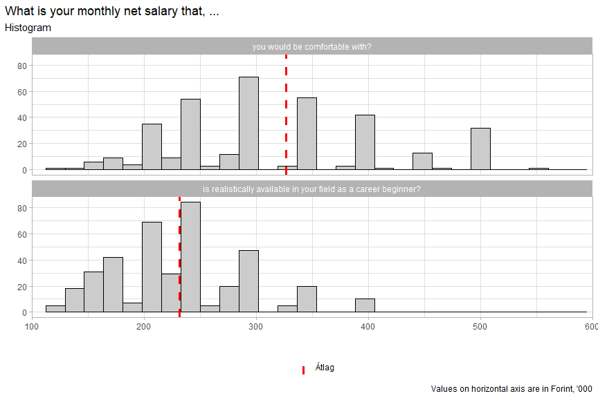

``` r
survey %>% ggplot(aes(x = comf_salary, y = real_salary)) +
  geom_hline(aes(yintercept = mean(survey$real_salary, na.rm = T), color = "Mean"), linetype = "dashed") +
  geom_vline(xintercept = mean(survey$comf_salary, na.rm = T), color = "black", linetype = "dashed") +
  geom_point(alpha = .5) +
  geom_smooth(method = "lm", color = "red") +
  scale_x_continuous(breaks = seq(from = 100000, to = 600000, by = 100000), labels = seq(from = 100, to = 600, by = 100), expand = c(0, 0), limits = c(100000, 600000)) +
  scale_y_continuous(breaks = seq(from = 100000, to = 600000, by = 100000), labels = seq(from = 100, to = 600, by = 100), expand = c(0, 0), limits = c(100000, 600000)) +
  labs(
    x = "you would be comfortable with?", y = "is realistically available\nin your field as a career beginner?", title = "What is your monthly net salary that ...",
    caption = "Values are in Hungarian Forint, '000",
    subtitle = str_c("r = ", survey %>% select(comf_salary, real_salary) %>% na.exclude() %>% cor() %>% min() %>% round(digits = 2))
  ) +
  scale_color_manual(values = c("Mean" = "black")) +
  theme(
    legend.position = "bottom"
  )
```

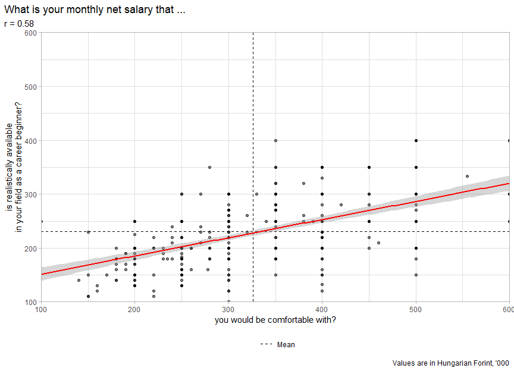

## Kapcsolatvizsgálat

``` r
cramer_matrix <- survey %>%
  select(-c(comf_salary, real_salary)) %>%
  mutate_all(funs(
    fct_explicit_na(., na_level = "not answered")
  )) %>%
  data.frame() %>%
  cramer() %>%
  data.frame()

cramer_matrix[upper.tri(cramer_matrix, diag = T)] <- ""

cramer_matrix <- cramer_matrix %>%
  data.frame() %>%
  rownames_to_column() %>%
  pivot_longer(-1) %>%
  transmute(
    x = factor(rowname, levels = names(survey), ordered = T),
    y = factor(name, levels = names(survey), ordered = T),
    value = value
  ) %>%
  filter(value != "") %>%
  mutate(
    value = as.numeric(value)
  )
```

``` r
ggplot(cramer_matrix) +
  geom_tile(aes(x = x, y = y, fill = value), color = "black", linejoin = "mitre", size = .5) +
  scale_fill_gradient(low = "white", high = "#FF5B6B") +
  labs(
    title = "Cramer-matrix", x = "", y = ""
  ) +
  theme(
    axis.text = element_text(size = 6),
    axis.text.x = element_text(angle = 90, hjust = 0.95, vjust = 0.2),
    legend.title = element_blank()
  )
```

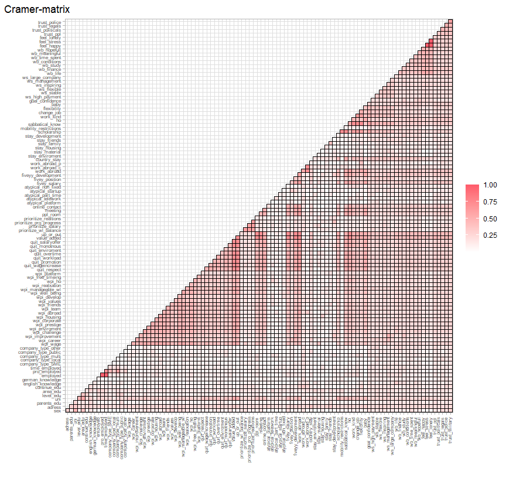

``` r
cramer_matrix %>%
  arrange(desc(value)) %>%
  mutate(
    value = round(value, digits = 2)
  ) %>%
  head(20) %>%
  knitr::kable(caption = "Pairings with the highest Cramer", align = c("c", "c", "c"))
```

|          x          |         y          | value |
| :-----------------: | :----------------: | :---: |
|    feel\_stress     |    feel\_happy     | 1.00  |
|    feel\_lonely     |    feel\_happy     | 1.00  |
|    feel\_lonely     |    feel\_stress    | 1.00  |
|   time\_employed    |      employed      | 0.98  |
|    pro\_employed    |      employed      | 0.98  |
|    value\_added     |  quit\_promotion   | 0.73  |
|       meeting       |    value\_added    | 0.72  |
|     up\_or\_out     | quit\_salaryoffer  | 0.72  |
| fiveyy\_development |    value\_added    | 0.72  |
|    value\_added     |  quit\_monotnous   | 0.72  |
|    value\_added     | quit\_salaryoffer  | 0.71  |
|    fivey\_salary    |    up\_or\_out     | 0.71  |
|     up\_or\_out     |   quit\_workload   | 0.71  |
|    value\_added     | quit\_wageincrease | 0.71  |
|     flexibility     |  sabbatical\_know  | 0.71  |
|     up\_or\_out     |  quit\_promotion   | 0.71  |
|    value\_added     |   quit\_respect    | 0.71  |
|     up\_or\_out     | quit\_wageincrease | 0.71  |
|     change\_job     |  sabbatical\_know  | 0.71  |
|    work\_abroad     |    value\_added    | 0.71  |

Pairings with the highest Cramer

``` r
H2_comf_salary <- vector()
df <- survey %>%
  select(-c(comf_salary, real_salary)) %>%
  mutate_all(funs(
    fct_explicit_na(., na_level = "not answered")
  ))

for (i in seq_along(df)) {
  H2_comf_salary[i] <- aov(formula = y ~ x, data = data.frame(y = survey$comf_salary, x = df[[i]])) %>%
    broom::tidy() %>%
    select(sumsq) %>%
    mutate(sumsq = sumsq / sum(sumsq)) %>%
    .[1, 1] %>%
    round(digits = 4)
}
names(H2_comf_salary) <- names(df)

data.frame(variable = df_names$variable[-c(59, 60)], H2 = as.numeric(H2_comf_salary)) %>%
  arrange(desc(H2)) %>%
  mutate(H2 = scales::percent(H2, accuracy = .01)) %>%
  head(15) %>%
  knitr::kable(caption = 'Relation between "What is your monthly net salary that you would be comfortable with?" and nominal variables (H^2)')
```

| variable                | H2     |
| :---------------------- | :----- |
| uni                     | 15.89% |
| area\_edu               | 13.99% |
| adress                  | 9.52%  |
| sex                     | 9.26%  |
| prioritize\_salary      | 7.65%  |
| goal\_confidence        | 7.43%  |
| fivey\_salary           | 7.19%  |
| work\_abroad\_c         | 6.68%  |
| quit\_wageincrease      | 6.43%  |
| trust\_military         | 5.98%  |
| wpi\_wage               | 5.88%  |
| ws\_inspiring           | 5.83%  |
| wb\_hopefull            | 5.03%  |
| prioritize\_wl\_balance | 4.27%  |
| wb\_meaningful          | 4.02%  |

Relation between “What is your monthly net salary that you would be
comfortable with?” and nominal variables (H^2)

``` r
H2_real_salary <- vector()
df <- survey %>%
  select(-c(comf_salary, real_salary)) %>%
  mutate_all(funs(
    fct_explicit_na(., na_level = "not answered")
  ))
for (i in seq_along(df)) {
  H2_real_salary[i] <- aov(formula = y ~ x, data = data.frame(y = survey$real_salary, x = df[[i]])) %>%
    broom::tidy() %>%
    select(sumsq) %>%
    mutate(sumsq = sumsq / sum(sumsq)) %>%
    .[1, 1] %>%
    round(digits = 4)
}

names(H2_real_salary) <- names(df)

data.frame(variable = df_names$variable[-c(59, 60)], H2 = as.numeric(H2_real_salary)) %>%
  arrange(desc(H2)) %>%
  mutate(H2 = scales::percent(H2, accuracy = .01)) %>%
  head(15) %>%
  knitr::kable(caption = 'Relation between "What do you think is the net monthly salary that is realistically available in your field as a career beginner?" and nominal variables (H^2)')
```

| variable             | H2     |
| :------------------- | :----- |
| area\_edu            | 28.59% |
| uni                  | 26.89% |
| goal\_confidence     | 11.63% |
| adress               | 10.70% |
| sex                  | 8.16%  |
| ws\_high\_payment    | 4.83%  |
| wb\_hopefull         | 4.79%  |
| company\_type\_multi | 4.68%  |
| wb\_study            | 4.61%  |
| wpi\_team            | 4.57%  |
| ws\_large\_company   | 4.46%  |
| wpi\_well\_being     | 3.60%  |
| trust\_ppl           | 3.59%  |
| meeting              | 3.28%  |
| work\_abroad\_c      | 3.24%  |

Relation between “What do you think is the net monthly salary that is
realistically available in your field as a career beginner?” and nominal
variables (H^2)
